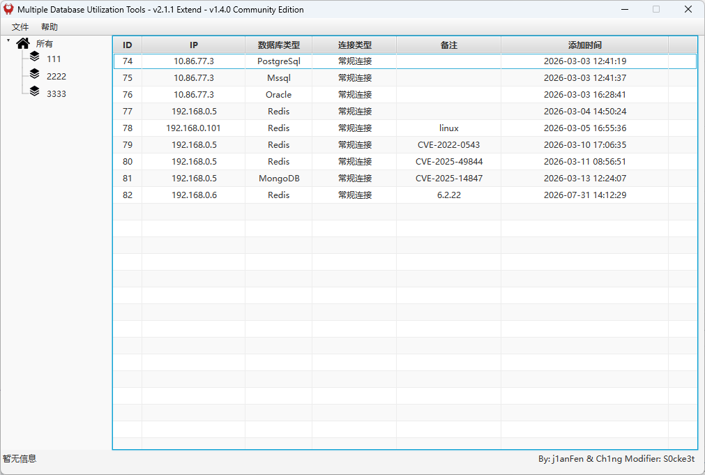

# MDUT-Extend
**MDUT-Extend** 是 [MDUT](https://github.com/SafeGroceryStore/MDUT)（Multiple Database Utilization Tools）的扩展版本，在原有 Mssql、Mysql、Oracle、Redis、PostgreSQL 的基础上增强了各数据库的利用能力，并新增了 MongoDB 等类型支持。工具以 JavaFX 作为 GUI 操作界面，支持多数据库同时操作、每种数据库相互独立，极大方便了网络安全工作者的使用。

> 下载 Release 版本请前往 [Release发布页](https://github.com/DeEpinGh0st/MDUT-Extend-Release/releases)

## 主要特性
- 支持 Mssql / Mysql / Oracle / Redis / PostgreSQL / MongoDB 多种数据库类型
- 新增 MongoDB 数据库利用与数据库存活扫描
- 新增 Redis CVE-2025-49844、CVE-2022-0543 、DoubleFree、TDigest利用
- 新增 Mssql Godpotato 等提权、加载 shellcode、综合利用
- 新增 Oracle 大文件上传下载，支持 SID 与 service 连接方式
- PostgreSQL 文件管理支持 pg func 与 cve 两种方式，兼容 Linux

## 截图

## 文档
[更新日志](./CHANGELOG.md)

## 致谢
本项目基于 [MDUT](https://github.com/SafeGroceryStore/MDUT) 开发，向 [Ch1ng](https://github.com/ch1ngg)、[j1anFen](https://jianfensec.com/) 及 SQLTOOLS - 深度撞击致敬，并感谢以下项目与作者：
[j1anFen](https://jianfensec.com/) / [冰蝎](https://github.com/rebeyond/Behinder) / [ODAT](https://github.com/quentinhardy/odat) / [MSDAT](https://github.com/quentinhardy/msdat) / SQLTOOLS - 深度撞击
 / [PayloadsAllTheThings](https://github.com/swisskyrepo/PayloadsAllTheThings) / [WarSQLKit](https://github.com/mindspoof/MSSQL-Fileless-Rootkit-WarSQLKit)

## 法律
> 本工具仅能在取得足够合法授权的企业安全建设中使用。在使用本工具过程中，您应确保自己所有行为符合当地的法律法规。如您在使用本工具的过程中存在任何非法行为，您将自行承担所有后果，本工具所有开发者和所有贡献者不承担任何法律及连带责任。 除非您已充分阅读、完全理解并接受本协议所有条款，否则，请您不要安装并使用本工具。您的使用行为或者您以其他任何明示或者默示方式表示接受本协议的，即视为您已阅读并同意本协议的约束。
